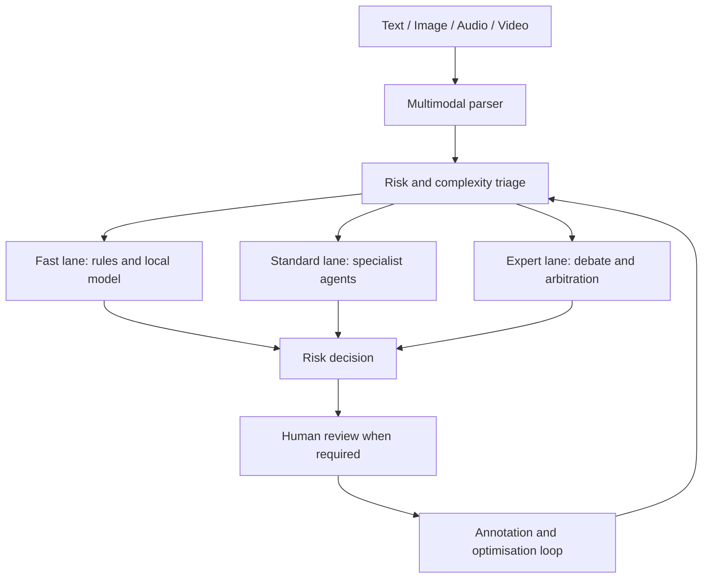

# Multimodal Content Risk-Control Agent

[English](README.md) | [简体中文](README.zh-CN.md)

A full-stack content-governance platform built with **LangGraph**, **FastAPI**,
**React**, and multimodal large language models. The system analyses text,
images, audio, and video, then routes each case through rules, local models,
LLM review, or human escalation according to risk and complexity.

## Highlights

- Multimodal ingestion with document parsing, OCR, ASR, visual understanding,
  and cross-modal consistency checks.
- A LangGraph state graph covering triage, specialist review, debate,
  reflection, final arbitration, and human-in-the-loop recovery.
- Three review lanes that match processing cost to content risk: fast,
  standard, and expert.
- An Aho-Corasick keyword engine plus normalization for homophones, split
  characters, Unicode confusables, and other evasive patterns.
- Long-document chunking and rule-hit context injection to reduce missed
  violations hidden in otherwise benign content.
- Feedback-driven optimisation through annotation, error analysis, prompt
  versioning, threshold tuning, and RAG case injection.

## Architecture



## Technology stack

| Layer | Technologies |
|---|---|
| Backend | FastAPI, LangGraph, SQLAlchemy 2.0 |
| Models | DeepSeek, Qwen3-VL, optional Ollama local model |
| Storage | PostgreSQL, Redis, ChromaDB |
| Retrieval | Hybrid RAG, GraphRAG, semantic cache |
| Audio | FunASR SenseVoiceSmall |
| Frontend | React, TypeScript, Vite, Recharts |
| Deployment | Docker Compose |

## Core workflow

1. Parse uploaded files and extract text, images, audio, video frames, OCR text,
   and ASR transcripts.
2. Fuse evidence while preserving the original context of embedded media.
3. Estimate content risk and complexity, then select a review lane.
4. Combine deterministic rules, specialist agents, retrieval evidence, debate,
   reflection, and final arbitration.
5. Escalate ambiguous cases to human reviewers and feed annotations into the
   optimisation loop.

## Quick start

### Requirements

- Python 3.10+
- Node.js
- PostgreSQL 16 and Redis
- Docker and Docker Compose for the containerised setup
- Ollama and FunASR are optional for the corresponding local services

### Local configuration

```bash
cp src/backend/.env.example src/backend/.env
```

Add the required model credentials to the ignored `.env` file, then start the
services:

```bash
bash start.sh
```

The frontend is available at `http://localhost:13000`, and the FastAPI
documentation is available at `http://localhost:18080/docs`.

### Docker

```bash
docker compose up -d --build
docker compose exec ollama ollama pull qwen2.5:7b
```

## Repository structure

```text
src/backend/           FastAPI API, LangGraph workflow, agents and storage
src/frontend/          React and TypeScript management interface
src/funasr/            Audio transcription service
skills/                Moderation and risk-control skill definitions
tests/                 Unit, integration and adversarial tests
eval/                  Benchmark runners and evaluation metrics
docs/                  Design and operating documentation
deploy/                Container deployment resources
```

## Validation

```bash
python -m compileall -q src/backend
cd src/frontend
npm ci
npm run build
```

The public repository copy passed the Python syntax check and the React
production build before publication. Model-dependent integration tests require
valid local credentials and supporting services.

## Documentation

- [Project introduction](docs/项目介绍.md)
- [Beginner guide](docs/零基础入门指南.md)
- [Operating guide and testing notes](docs/用户操作指南与测试要点.md)
- [Core design and source-code walkthrough](docs/核心技术及其源码解读.md)

## Security and responsible use

API credentials, runtime databases, uploaded content, logs, model weights, and
local evaluation outputs are excluded from version control. Read
[SECURITY.md](SECURITY.md) before deployment.

This is an educational content-moderation prototype. Production use should
retain human review for ambiguous or high-impact decisions and should not treat
model output as a legal or compliance guarantee.
