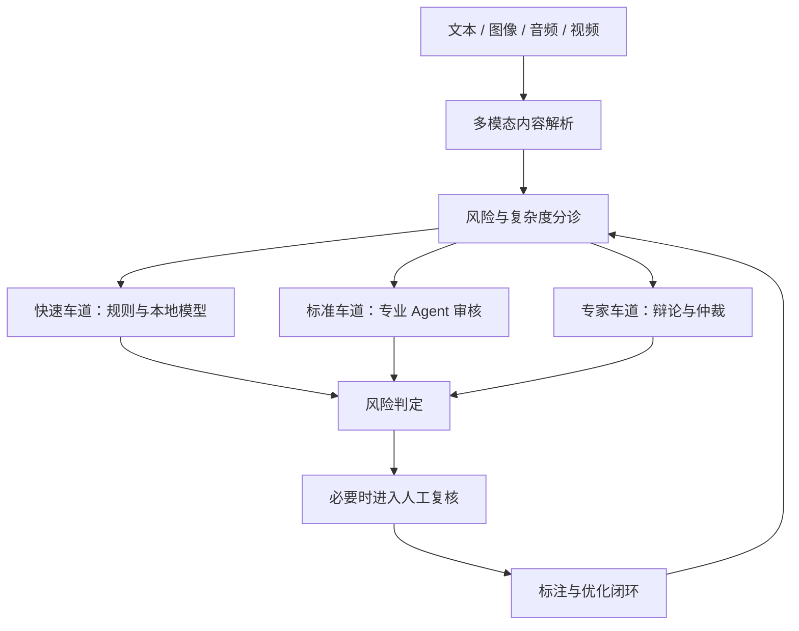

# 多模态内容风控 Agent

[English](README.md) | [简体中文](README.zh-CN.md)

这是一个基于 **LangGraph、FastAPI、React 与多模态大模型** 构建的内容风控治理平台。系统支持文本、图像、音频和视频内容解析，并依据内容风险与复杂度，将任务分配给规则引擎、本地模型、大模型审核链路或人工复核。

## 项目亮点

- 支持文档解析、OCR、ASR、视觉理解和跨模态一致性校验。
- 基于 LangGraph 状态图实现分诊、专业 Agent 审核、辩论、反思、终审裁决和人工兜底。
- 通过快速、标准、专家三条审核路线，使审核成本与内容风险相匹配。
- 使用 AC 自动机敏感词引擎，并对同音字、拆字、Unicode 混淆等对抗形式进行归一化识别。
- 对长文本进行分段并行审核，并将规则命中片段及其上下文注入模型，降低隐藏违规内容的漏审风险。
- 通过自动标注、错误分析、Prompt版本管理、阈值调整和RAG案例注入形成持续优化闭环。

## 系统架构



## 技术栈

| 模块 | 技术 |
|---|---|
| 后端 | FastAPI、LangGraph、SQLAlchemy 2.0 |
| 模型 | DeepSeek、Qwen3-VL、可选Ollama本地模型 |
| 存储 | PostgreSQL、Redis、ChromaDB |
| 检索 | Hybrid RAG、GraphRAG、语义缓存 |
| 音频 | FunASR SenseVoiceSmall |
| 前端 | React、TypeScript、Vite、Recharts |
| 部署 | Docker Compose |

## 核心流程

1. 解析上传文件，提取正文、图片、音频、视频帧、OCR文字和ASR转写。
2. 在保留媒体原始上下文位置的基础上融合多模态证据。
3. 联合评估风险与复杂度，选择相应审核车道。
4. 综合规则、专业Agent、检索证据、辩论、反思和终审仲裁形成判定。
5. 将低置信度或高影响案例升级为人工复核，并将人工标注反馈至优化闭环。

## 快速开始

### 环境要求

- Python 3.10+
- Node.js
- PostgreSQL 16 与 Redis
- 使用容器部署时需要 Docker 与 Docker Compose
- Ollama 与 FunASR仅在启用相应本地服务时需要

### 本地配置

```bash
cp src/backend/.env.example src/backend/.env
```

在已被Git忽略的 `.env` 文件中填写模型密钥，然后启动服务：

```bash
bash start.sh
```

前端地址为 `http://localhost:13000`，FastAPI接口文档地址为 `http://localhost:18080/docs`。

### Docker部署

```bash
docker compose up -d --build
docker compose exec ollama ollama pull qwen2.5:7b
```

## 目录结构

```text
src/backend/           FastAPI接口、LangGraph工作流、Agent与存储层
src/frontend/          React与TypeScript管理界面
src/funasr/            音频转写服务
skills/                风控审核技能定义
tests/                 单元、集成与对抗测试
eval/                  评测流程与指标计算
docs/                  设计和使用文档
deploy/                容器部署资源
```

## 验证方式

```bash
python -m compileall -q src/backend
cd src/frontend
npm ci
npm run build
```

公开仓库副本在发布前已通过Python语法检查和React生产构建。依赖真实模型的集成测试需要在本地配置有效密钥及相关服务后运行。

## 项目文档

- [项目介绍](docs/项目介绍.md)
- [零基础入门指南](docs/零基础入门指南.md)
- [用户操作指南与测试要点](docs/用户操作指南与测试要点.md)
- [核心技术及其源码解读](docs/核心技术及其源码解读.md)

## 安全与使用边界

API密钥、运行数据库、上传内容、日志、模型权重和本地评测结果均不会进入版本控制。部署前请阅读 [SECURITY.md](SECURITY.md)。

本项目是内容审核方向的教学与工程实践原型。实际生产环境应对低置信度及高影响决策保留人工复核，模型输出也不应被视为法律或合规保证。
