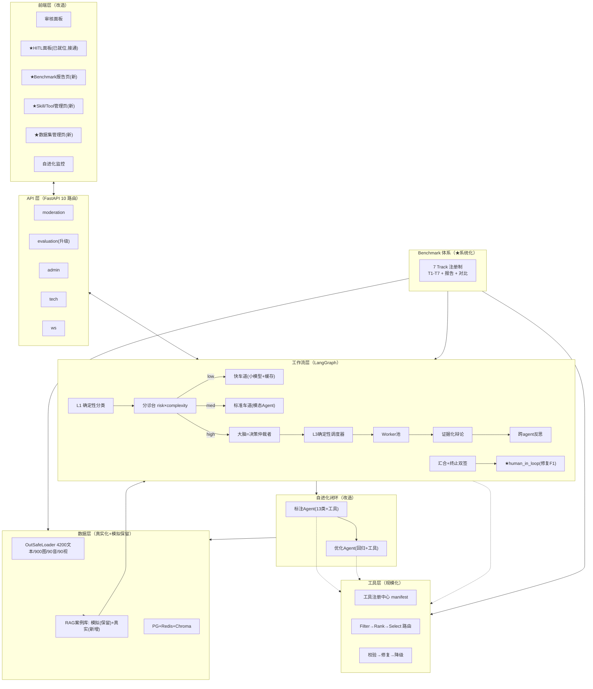

# 内容风控智能治理系统 — 最终详细设计（秋招项目版）

> 版本：v1.0 ｜ 日期：2026-08-06
> 定位：**一版可执行的最终详细设计**。整合《Agent工程深度演进规划》《综合修改计划与改动点分析》《框架演进对比与流程图》全部内容，新增：①标注/优化接入工具与 skill；②系统化 Benchmark 测评体系；③前后端/界面/功能逻辑全面审查；④**模拟案例保留策略**。
> 既定约束：不做模型训练/RL（12GB 显存）；小模型只开源量化（接口按可训练设计）；模拟案例**保留**、真实数据并行。
> 指标标注：✅ 有代码支撑 ｜ ⚠️ 预估待实测。

---

## 0. 文档说明

- **目标**：通过字节「大模型应用算法 + Agent 开发」秋招，项目有真实数据、真实指标、系统化评测、可讲故事。
- **改造总原则**：`现有功能全部保留`，在现有骨架上"接线、补链、增强"——不推倒重来。
- **三条铁律**：①模拟案例不删，真实数据并行（source 区分）；②所有改动有 Benchmark 验收；③不做模型训练，但接口按可训练设计。

---

## 1. 项目全景与现状审查（前后端）

### 1.1 技术栈总览

| 层 | 技术 | 现状 |
|---|---|---|
| 前端 | React 18 + Vite + TS + Tailwind + recharts + react-router v7 | 10 页面 / 14 组件 / 6535 行 |
| 后端 | FastAPI + LangGraph + SQLAlchemy(PG) + Redis + ChromaDB | 10 路由 / ~20 模块 |
| 审核核心 | LangGraph StateGraph + MemorySaver checkpointer | 11 节点（实际连 6-7 个） |
| 记忆/RAG | PG + Redis + Chroma（BM25+Dense+RRF+Rerank） | 4 层检索已就绪 |
| 模型 | DeepSeek(API) + 本地 bge 系列 | 无本地 LLM 部署 |
| 工具 | MCP registry 8 工具 + 3 skill + RBAC | 未规模化 |
| 自进化 | 标注 Agent + 优化 Agent + FeedbackLoop | 闭环存在但数据源是模拟 |

### 1.2 后端架构

```
src/backend/
├── main.py                  # FastAPI 入口，挂 10 路由 + WS
├── api/routes/              # moderation / async / query / admin / logs / evaluation / policies / tech / mcp / ws
├── agent_moderation/        # workflows(moderation.py 2086行) + agents(11个) + workers + skill_registry + state
├── memory/                  # manager / hybrid_retriever / agentic_rag / graph_rag / multimodal_rag / chroma / redis / agent_memory
├── mcp_servers/ + mcp_gateway/  # registry(8工具) + access_control(RBAC)
├── optimization/            # annotation_agent / annotation_queue / optimization_agent / prompt_optimizer
├── security/                # input_guard 双层
├── common/                  # api_clients / logger / settings
├── db/                      # models.py(4表) + connection
└── eval/ (独立于 src)       # eval_harness(226行) + test_samples(构造) + metrics + judges
```

### 1.3 前端架构

| 路由 | 页面 | 组件行数 | 现状 |
|---|---|---|---|
| /dashboard | Dashboard | 445 | 概览 |
| /moderate | ModerationPanel | 476 | 多模态审核入口 |
| /async | AsyncModeration | 422 | 异步任务 |
| /review | **HumanReviewPanel** | 516 | **人工审核界面已就位** |
| /optimization | OptimizationMonitor | 1065 | 自进化监控 |
| /history + /history/:id | HistoryList / Detail | 346/569 | 历史与推理链 |
| /system | SystemMonitor | 225 | 系统监控 |
| /lab | TechLab | 1104 | 技术实验室（prompts/tools/skills） |
| /policies | PolicyManager | 471 | 策略管理 |

### 1.4 现状审查结论（断点清单，✅已确认）

| # | 断点 | 证据 | 影响 |
|---|---|---|---|
| F1 | **HITL 两端齐全、中间断路** | API 层有 `pending-reviews`+`review`+`_register_pending_review`（moderation.py:518/608/642）；前端 HumanReviewPanel 就位；但工作流 `human_in_loop` 节点**无入边**（moderation.py:2062 无入口边）→ Redis 队列永远空 | 人工审核整个流程是死管道 |
| F2 | debate/reflexion 函数在、未接图 | `debate_node`(1022)/`reflexion_node`(1082)/`route_to_debate`(1847) 均未编译进图 | 深度能力挂空挡 |
| F3 | ModelRouter 复杂度分级未消费 | `workers/model_router.py` 存在，无调用方 | 分级逻辑浪费 |
| F4 | annotation_records 无 ORM | 硬编码 SQL INSERT（moderation.py:281），不在 `db/models.py` | 新环境建不了表，优化数据源悬空 |
| F5 | RAG 案例库是 500+ 模拟种子 | `seed_rag_data.py` 手写案例 + 50 模拟图片 | 检索参考价值存疑 |
| F6 | eval 单流程未 track 化 | `eval_harness.py` 仅 226 行，单 `run_full_eval` | 无法系统评测 |
| F7 | skills 仅 3 个 | `skills/` 目录只有 3 个 SKILL.md | 无法体现规模化 |
| F8 | 前端无数据/评测/skill 管理页 | 路由表无对应页面 | 数据与评测不可视 |

---

## 2. 总体目标架构（一张图）



---

## 3. 后端核心改造设计

### 3.1 编排层（E1-E4，含 F1 修复）

| # | 设计 | 关键实现 |
|---|---|---|
| E1 | 大脑=决策仲裁者（L2） | 复用 `agents/planner.py` TaskPlanner，4 类决策（规划/仲裁/升级/终止建议），tier=high 激活，输出结构化 plan，失败回退 `planner_node` |
| E2 | 分诊台 | 规则粗筛 + 小模型联合输出 `{risk,complexity}` + 单边保守校准；消费 F3 的 ModelRouter |
| E3 | 三车道 + 终止双签 | low=快车道 / med=现状 / high=深度；终止=大脑建议(软)+确定性校验(轮次/证据/高危,硬) |
| E4 | **HITL 修复（F1）** | **接线位置**：`risk_agent_node` 阶段2 出 REVIEW 或 `_human_review.required` → 条件路由 → `human_in_loop`；大脑③升级建议同样触发。节点内调用已有 `_register_pending_review`（Redis 队列）→ 前端 `HumanReviewPanel` 消费 `pending-reviews` → `POST /review` resume。**用 LangGraph `interrupt()` 真挂起 + `Command(resume)` 恢复**，注入 `human_decision` → 复核 → END |

**E4 是 F1 修复的核心**：前后端代码一行不改，只补工作流层的"入边 + 触发"。

### 3.2 工具层（T1-T4 + L4）

| # | 设计 | 关键实现 |
|---|---|---|
| T1 | 规模化三级路由 | 工具注册中心（manifest 注册，新增只写 yaml）+ 双索引粗筛（元数据倒排+向量）+ 渐进加载 + 路由缓存 + 灰度/下线治理；修复 F7（skills 3→几十个，可扩展） |
| T2 | 工具可靠性 | jsonschema 校验→LLM 修复(1次)→降级链 |
| T3 | 工具质量分 | 每次调用记正贡献→质量分→降权/灰度/下线 |
| T4 | 工具调用分层 | 所有 agent 统一走 skill_router；ReAct 只留深挖 agent |
| L4 | **标注/优化 Agent 接入工具与 skill（★新增）** | 见 §3.6 |

### 3.3 模型层（M1-M2）

- **M1 级联**：小模型快路径（意图/粗判/路由）+ DeepSeek 兜底；升级阈值 ECE 校准曲线决定。
- **M2 语义缓存**：嵌入相似度≥0.95 命中；违规结果不缓存/短 TTL。

### 3.4 质量层（Q1-Q2，修复 F2）

- **Q1 多模态融合升级**：深水区证据化融合（各模态证据一起判），规则跨模态关联 0 LLM 兜底，图文矛盾交大脑仲裁。
- **Q2 辩论+Reflexion 升级**：opinion 带证据链 + 多轮互相反驳（上限2）+ 权重动态化；反思升级为跨 agent 反馈写记忆。**在 high 路径重接 F2 的 debate/reflexion**。

### 3.5 数据真实化（D1-D5，模拟保留）

| # | 设计 | 关键实现 |
|---|---|---|
| D1 | OutSafeDatasetLoader | `eval/datasets/out_safe_loader.py`：xlsx+图片+音频+视频；懒加载缓存；音频读 bytes 喂 AudioAgent |
| D2 | label 映射 | 枚举 7→**13 类**（+privacy/discrimination/crime/ethics/health/copyright）；TEXT_MODERATION_PROMPT 同步 |
| D3 | 双口径+负样本 | content/request_intent 双 prompt；构造 1000+ 安全负样本 |
| D4 | 多模态预标注 | 900 图/90 视频/90 音频；中性图标"安全"；可先标注抽样子集 |
| D5 | 评测真实化 | 7 Track 主数据源换 OutSafe；构造数据降为冒烟测试 |

**模拟保留策略（★用户要求）**：`seed_rag_data.py` 的模拟案例**不删除**，标注 `source=simulated`；新增真实案例 `source=out_safe`。两者在 Chroma 并行共存，**检索时按来源加权（真实优先，见 G2）**，绝不清空。

### 3.6 标注/优化闭环改造（L1-L4）

| # | 设计 | 关键实现 |
|---|---|---|
| L1 | 标注 Agent 升级 | 规则库 6→13 类；**有 ground truth 直接核对**（is_error 变确定性比对）；与 E4 对接（人工决策写 annotation_records, weight=3.0） |
| L2 | 优化 Agent 升级 | **每次优化后跑 7 Track 回归，变差自动回滚**；keyword_update 13 类；rag_case_add 用验证过的真实样本；threshold 与 ECE 联动 |
| L3 | 标注队列正规化（F4） | `annotation_records` 补 ORM + migration；新增 `dataset_samples` 表 |
| L4 | **标注/优化接入工具与 skill（★新增）** | 见下 |

**L4 设计（标注/优化如何调工具/skill）**：
- **标注 Agent 工具化**：三视角校验的第①视角"规则复核"从硬编码关键词升级为**动态调用 keyword_check / history_search / rag_retrieve**（走 skill_router）——标注时能"查历史相似案例"佐证 `is_error` 判断；语义矛盾检测可调用 `adversarial_detect` 辅助。工具结果作为第三视角证据。
- **优化 Agent 工具化**：优化分析的 `_get_keywords_summary` 从读静态配置改为**调用 skill_router 查询关键词/规则工具**；`rag_case_add` 动作执行时**通过 history_search 先检索最相似已有案例**（去重，避免重复入库）；优化报告的生成可调用 `tech` 层工具做指标查询。
- **统一基建**：L4 复用 T1 的 skill_router + T2 的可靠性 + T3 的质量分——标注/优化对工具的调用同样被度量、被校验，进入工具质量闭环。
- **验收**：标注流程可触发 history_search 且结果进入 AnnotationResult；优化 rag_case_add 前做相似度去重（>0.9 跳过）；工具质量分覆盖标注/优化调用。

### 3.7 RAG/数据库真实化（G1-G7，模拟保留）

| # | 设计 | 关键实现 |
|---|---|---|
| G1 | RAG 案例真实化 | 新写 `seed_out_safe.py` 增量灌入真实案例（**不清空模拟**），`source=out_safe` |
| G2 | metadata 来源字段 | 加 `ground_truth`(confirmed/model_labeled)、`source_dataset`(out_safe/simulated/production)；**检索融合时 confirmed>out_safe>simulated>model_labeled 权重递减** |
| G3 | 时间衰减修正 | 离线种子案例标记 no_decay（7 天半衰期不对种子生效） |
| G4-G6 | AgenticRAG/GraphRAG/多模态 RAG | 意图对齐 13 类；GraphRAG 图重建；多模态用真实图/音/视频 |
| G7 | T3 评测 | OutSafe 做 query + ground truth 标注 → Recall@k/MRR/NDCG，四路对比 |

### 3.8 训练前瞻（R1-R3）

- **R1 SFT**（12GB 可行）：Qwen2.5-1.5B 意图预筛 / 3B 工具路由 / 3B 粗判，QLoRA 4bit。
- **R2 Agentic RL**：GRPO 1.5B（12GB 极限）→ 3B 需租卡；先 SFT 后 RL。
- **R3 数据飞轮**：HITL + hard case + 自进化 → 回流训练集；local client 接口可替换。

---

## 4. Benchmark 测评体系（★系统化，修复 F6）

### 4.1 体系架构

```
eval/runners/harness_v2.py  (新增)
  Track 注册制:
    TRACKS: Dict[str, Track] = { "T1_intent": ..., "T2_adversarial": ..., "T3_rag": ..., ... }
    Track 接口: async def run() -> TrackResult | def describe() -> str
  Runner:
    EvalHarnessV2:
      register_track(name, track)      # 注册制，新增评测只写一个类
      run(track_filter=None)           # 串/并行执行，每 track 独立数据/指标
      report() -> Report                # JSON + Markdown
      compare(baseline_report)         # 与基线对比，回归检测
  CI 集成: P8 全量回归自动化，改动合入前跑 diff
```

### 4.2 7 Track 定义

| Track | 测什么 | 指标 | 数据源 |
|---|---|---|---|
| T1 意图/判定 | 违规识别准确率与校准 | Accuracy / Macro-F1 / Precision / FPR / **ECE / Brier** | OutSafe 4200 文本 + 负样本 1000+ |
| T2 对抗鲁棒性 | 注入/混淆攻击 | 攻击后准确率下降Δ / 拦截率 | 对抗样本集（构造+变体） |
| T3 RAG 检索 | 检索质量 | **Recall@k / MRR / NDCG**；四路对比 | OutSafe 文本做 query，ground truth 标注 |
| T4 Skill/MCP | 工具选择与调用 | Hit@3 / 分桶命中率 / 成功率 / 注入 token 节省 | 任务→工具标注集 |
| T5 多模态 | 图/视频/音频审核 | 各模态 Accuracy / 图文矛盾样本准确率 | OutSafe 900图+90视+90音（标注子集） |
| T6 Agent 链路 | 深度任务编排 | 多轮完成率 / REPLAN 触发数 / 辩论轮次 | 构造复杂任务 + 真实多模态 |
| T7 成本延迟 | 级联与路由收益 | 快车道延迟 / token / 升级率 / 工具路由 p95 | 抽样线上+离线混合 |

### 4.3 报告与对比机制

- **报告**：`report.md`（人读）+ `report.json`（机读），含每个 track 的指标表、样本数、成本、对比基线 diff。
- **基线**：`baseline.json` 固化（P1 首跑），后续每次改动跑 diff——**回归检测**（T1 不回退、T7 成本下降），是 L2 优化回滚和 CI 的依据。
- **数据管理**：从 `dataset_samples` 表读样本，track 自带采样/缓存策略（全量 LLM 评测抽样 + 缓存）。

### 4.4 Benchmark 前端（修复 F8）

新增 **Benchmark 报告页**（`/benchmark`）：Track 结果表格（指标 vs 基线，涨绿跌红）+ recharts 趋势图（多次运行历史）+ 触发重跑按钮（调 evaluation API）。

---

## 5. 前端/界面改造（★系统审查）

### 5.1 现状审查结论

- **已有的能用**：ModerationPanel、History、SystemMonitor、TechLab、OptimizationMonitor（1065 行，功能完整）。
- **已就位但后端断路**：HumanReviewPanel（F1 修复后即可用，前端零改动）。
- **缺失的页面**：Benchmark 报告、Skill/Tool 管理、数据集管理。

### 5.2 新增页面

| 页面 | 路由 | 功能 | 对接 API |
|---|---|---|---|
| Benchmark 报告 | /benchmark | Track 结果表 + 趋势图 + 重跑 | evaluation 升级接口 |
| Skill/Tool 管理 | /skills | manifest 列表 + 质量分 + 灰度状态 + 新增注册 | tech/tools 扩展 |
| 数据集管理 | /dataset | OutSafe 导入进度 + 标注状态 + 负样本统计 | admin/dataset 新增 |

### 5.3 现有页面增强

| 页面 | 增强 |
|---|---|
| ModerationPanel | 展示 tier 路径（low/med/high 走了哪条）+ 大脑 plan 摘要 |
| HumanReviewPanel | 接通后无需改动；补"关联案例"（history_search 结果） |
| PipelineFlowChart | 补 human_in_loop / 大脑 / skill_router 节点 |
| Dashboard | 加 Benchmark 入口卡片 |

---

## 6. 前后端联调与功能逻辑修复清单

| # | 断点 | 修复 | 涉及 |
|---|---|---|---|
| F1 | HITL 断路 | E4 工作流接线（前后端零改动） | workflows + redis |
| F2 | debate/reflexion 挂空挡 | Q2 在 high 路径重接 | workflows |
| F3 | ModelRouter 未消费 | E2 分诊台消费 | model_router |
| F4 | annotation_records 无 ORM | L3 补 model+migration | db/models |
| F5 | RAG 模拟种子 | G1 保留模拟+加真实 | seed 脚本 |
| F6 | eval 单流程 | §4 harness_v2 | eval/runners |
| F7 | skills 仅 3 个 | T1 规模化 | skills + skill_router |
| F8 | 前端缺页面 | §5.2 新增 3 页 | frontend |

---

## 7. 阶段计划与里程碑

| 阶段 | 内容 | 验证 |
|---|---|---|
| **P0** | D1-D5 + L1(规则库) + L3 + G1-G3 + **G7 基线** | 真实数据 loader + label 映射 + RAG 真实案例(保留模拟) + dataset_samples 表 + **T3 RAG 四路对比第一版** |
| P1 | §4 harness_v2 全 7 Track + baseline.json | **完整 Benchmark 基线报告**（改动前数字） |
| P2 | E1-E3（大脑+分诊台+三车道） | 简单请求成本↓、准确率不回退 |
| P3 | T2 + T4 + **E4(HITL 修复 F1)** + tracing | 工具不死、**人工审核真正跑通**（前端已就位） |
| P4 | T1 规模化 + M2 + **L4(标注/优化工具接入)** + skills 扩到几十 | 上百工具选得准、标注/优化可调工具 |
| P5 | Q1 + Q2 + G4-G6（重接 F2） | 多模态证据化、真辩论、多模态 RAG 真实化 |
| P6 | T3 + L2（优化回归回滚） | 工具质量闭环、优化可信 |
| P7 | M1 + R1(SFT) | 小模型级联 + 微调替换（接口不变） |
| P8 | 全量回归 + 前端 3 页 + 报告归档 | **7 Track 全绿 + 简历数字固化** |
| P9 | R2(Agentic RL) 租卡 | 与 SFT 基线对比 |

---

## 8. 验收指标汇总

| 域 | 指标 | 目标 | 状态 |
|---|---|---|---|
| 识别 | Macro-F1 / Precision / FPR | 基线后定 | ⚠️ |
| 校准 | ECE / Brier | 级联后 ECE↓ | ⚠️ |
| RAG | Recall@10 / MRR / NDCG | 四路对比出最优 | ⚠️ |
| 工具 | Hit@3 / 成功率 / 分桶命中率 | ≥0.85 / ≥95% / ≥0.98 | ⚠️ |
| 成本 | 快车道延迟 / token / 升级率 | <500ms / ↓% | ⚠️ |
| 链路 | 多轮完成率 / REPLAN 统计 | 基线上↑ | ⚠️ |
| 自进化 | 标注核对一致率 / 优化回滚率 | 一致率↑ / 回滚可统计 | ⚠️ |

---

## 9. 风险与诚实边界

| 项 | 说明 |
|---|---|
| 模拟案例保留 | 检索融合必须按来源加权（G2），否则模拟污染真实；验收断言 confirmed/out_safe 优先 |
| HITL 依赖 interrupt | 需验证 LangGraph 版本支持 interrupt+resume（MemorySaver 已就位） |
| 数据标注工作量 | 多模态预标注先做抽样子集（每类 20%）跑通 T5 |
| 优化回归成本 | 抽样子集回归 + 缓存 |
| 全量 LLM 评测成本 | 抽样 + 缓存策略 |
| RL 时机 | 必须 SFT 后；12GB 只能 1.5B，3B 租卡；不虚报"已做 RL" |
| 指标真实性 | 所有 ⚠️ 在对应阶段实测后转 ✅，禁止虚构 |
