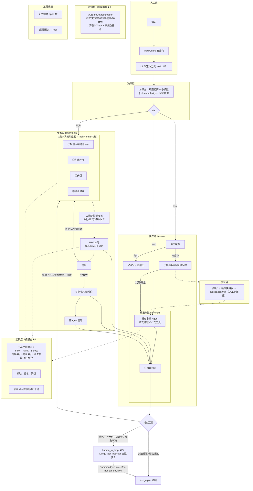

# 综合修改计划与改动点分析（最终版 v2.0）

> 版本：v2.1 ｜ 日期：2026-08-06
> v2.0 新增：① HITL 真正对接（LangGraph interrupt 机制）；② skills/mcp 成百上千规模化调度策略；③ OutSafe-Bench 真实数据集（含新增 audio）接入改造；④ 微调 + Agentic RL 前瞻路线。
> v2.1 新增：⑤ 标注/优化闭环改造（L 组）；⑥ RAG 全链路与数据库真实化改造（G 组）。
> 既定约束：不做模型训练/RL（12GB 显存）——但**接口与数据按可训练设计**，租卡即可升级（见 R 组）。
> 指标标注：✅ 有代码支撑 ｜ ⚠️ 预估待实测。

---

## 1. 最终目标架构（一张图）

---

## 2. 改动点逐条分析

### 主线 1：编排层（大脑 + 三层 + 分流 + HITL）

#### E1 大脑 = 决策仲裁者（新增，核心）
- **现状**：无编排 Agent；多模态走固定调度。
- **动作**：L2 编排 Agent（复用 `agents/planner.py` TaskPlanner），只做规划/仲裁/升级/终止建议 4 类决策；**按 tier 分级激活**（low/med 不经过）；输出结构化 plan（JSON schema）；失败回退确定性路径。
- **效果**：复杂任务可分解可并行可重规划；决策可审计。
- **验收**：T6 多轮完成率↑；REPLAN 可统计。｜ **阶段**：P2 ｜ **涉及**：`workflows/moderation.py`、`agents/planner.py`。

#### E2 分诊台（risk×complexity 联合估计）
- **现状**：ModelRouter 存在未消费；全走大模型。
- **动作**：规则粗筛 + 小模型一次输出 `{risk, complexity}` + 单边保守校准。
- **验收**：T1 精确率不回退；"高危但简单"样本必走深度。｜ **阶段**：P2 ｜ **涉及**：`workers/model_router.py`、`state.py`。

#### E3 三车道分流 + 终止双签
- **动作**：low 快车道 / med 标准 / high 专家车道；终止 = 大脑建议（软）+ 确定性校验（轮次上限/证据充分/高危未决，硬）双签。
- **验收**：T7 快车道<500ms；构造"大脑想终止但证据不足"样本断言不终止。｜ **阶段**：P2。

#### E4 人工审核真正对接（★ 本次新增，替代原 Q3）
- **现状**：`human_in_loop` 孤立节点，无入边永不触发；risk_agent 判"需人工"只写标记（`_human_review`），**没有人真的被叫来，流程无法恢复**。
- **动作**（三个触发入口 + interrupt 挂起/恢复）：
  1. **触发入口 A**：risk_agent 阶段2 终判出 REVIEW / `needs_human_review` → 条件路由 → `human_in_loop`。
  2. **触发入口 B**：大脑（E1③）升级建议（证据不足/低置信/对抗）→ `human_in_loop`。
  3. **触发入口 C**：终止双签校验不过且高危未决 → 强制升人工（保守方向）。
  4. **挂起/恢复机制**：用 LangGraph `interrupt()`（`create_moderation_workflow` 已用 `MemorySaver` checkpointer，天然支持）实现**真挂起**——执行到人工节点时挂起并保存 state，人工在外部界面决策后 `Command(resume=human_decision)` 恢复，注入 `state["human_decision"]` → risk_agent 复核 → END。**替代"标记 PENDING 后 return"的假实现**。
- **效果**：高风险真能升级人工，且**流程可恢复、可审计**（谁审的、判了什么、何时恢复）。
- **验收**：构造需人工样本断言 interrupt 挂起；resume 后 human_decision 注入且 final_decision 正确流转。｜ **阶段**：P3 ｜ **涉及**：`workflows/moderation.py`（路由层 + 节点改造）、`state.py`（`_human_review`/`human_decision` 语义对齐）、API 层（人工决策接口）。

### 主线 2：工具层（规模化调度 + 工具工程）

#### T1 成百上千 skills/mcp 规模化调度（★ 本次深化）
- **现状**：8 工具按 tag 匹配；上版三级路由设计有雏形，但未考虑**上百→上千**的规模。
- **规模化要解决的真问题**：①路由延迟（上千工具全扫太慢）；②schema/描述检索质量；③冷启动（新工具无向量/无质量分）；④治理（版本/灰度/下线/审计）。
- **动作**（五件套）：
  1. **工具注册中心（MCP manifest 式）**：每工具一份 manifest `{name, description, inputSchema, domain_tags[], modality, cost, rbac_level, version, status}`。**新增工具 = 写一份 manifest 自动注册**，不改代码（对应"成百上千可扩展"）。
  2. **双索引粗筛**：元数据倒排索引（domain×modality×cost×rbac 组合键分桶）+ 向量索引（bge 描述/示例嵌入）；两路并行取并集 → 候选集，把"全扫"降为"索引命中"。
  3. **渐进加载**（强化现有 `skill_registry` L1/L2/L3）：L1 元数据（~100 token）→ L2 完整描述+schema → L3 实现/示例代码懒加载。
  4. **路由缓存**：任务意图 → 路由结果缓存（避免重复 LLM 裁决），路由延迟 p95 < 50ms⚠️。
  5. **治理闭环**：质量分（T3）+ 版本化 + **灰度**（新工具只放 10% 流量）+ 下线（低质/废弃）+ 全量审计。
- **规模分层**：上百 = Filter(分桶)+Rank(语义)+Select(LLM 裁决)；上千 = 加两级分桶（粗分桶→细分桶）+ 路由缓存 + 分布式索引（按 domain 分片）。
- **验收**：T4 Hit@3≥0.85⚠️；分桶命中率≥0.98⚠️；**新增 1 个工具只加 manifest 不改代码可被路由命中**；路由 p95 延迟⚠️。｜ **阶段**：P4 ｜ **涉及**：新增 `skill_router.py` + `tool_registry.py`（manifest 注册）+ `skill_registry.py` 强化。

#### T2 工具可靠性工程
- **动作**：jsonschema 校验 → LLM 修复（1次）→ 降级链。｜ **验收**：成功率≥95%⚠️；30 非法参数用例全拦截。｜ **阶段**：P3。

#### T3 工具质量反馈闭环
- **动作**：每次调用记"是否正贡献"→ 质量分 → 降权/灰度/下线。｜ **阶段**：P6。

#### T4 工具调用分层
- **动作**：所有 agent 统一走 skill_router；ReAct 只留深挖 agent，编排用 Plan-and-Execute，其余单次推理。｜ **阶段**：P3-P4。

### 主线 3：模型层（大小模型协同）

#### M1 大小模型级联
- **动作**：小模型快路径（意图/粗判/路由）+ DeepSeek 兜底；升级阈值由 ECE 校准曲线决定。｜ **验收**：升级率、成本↓⚠️、F1 差距<2pp⚠️。｜ **阶段**：P7。

#### M2 语义缓存
- **动作**：嵌入相似度≥0.95 命中；违规结果不缓存/短 TTL。｜ **阶段**：P4。

### 主线 4：质量层（深度机制升级）

#### Q1 多模态融合升级（非文本中心）
- **动作**：深水区证据化融合（各模态证据一起判）；规则跨模态关联 0 LLM 兜底；图文矛盾交大脑仲裁。｜ **验收**：T1 图文矛盾样本准确率↑⚠️。｜ **阶段**：P5。

#### Q2 辩论升级 + Reflexion 升级
- **动作**：opinion 带证据链 + 多轮互相反驳（上限2轮）+ expertise_weight 动态化；Reflexion 升级为跨 agent 反馈写记忆。｜ **阶段**：P5-P6。

### 主线 5：工程底座

#### P1 可观测性 + 状态 + 评测（3 合 1）
- **动作**：span 树 + 成本/失败归因；state 加 `_tier/_plan_context/_routed_tools/_tool_telemetry`；harness_v2 七 Track。｜ **阶段**：P1/P3。

### 主线 6：数据真实化（★ 本次新增，D 组）

**核心事实**（代码 + 统计确认）：`data/OutSafe-Bench` = 9 类目录，每类 `Chinese Text.xlsx`(200) + `English Text.xlsx`(~267) + `pictures/`(100) + `video/`(10) + **`audio/`(10，本次新增)**。合计 **4200 文本 / 900 图 / 90 视频 / 90 音频**；xlsx 单列 `prompt`，**目录类别即 ground truth**；音频为真实场景录音（wav/m4a 混合）。

#### D1 OutSafeDatasetLoader（新增）
- 新建 `eval/datasets/out_safe_loader.py`：解析 xlsx（单列 prompt）+ 图片/音频/视频目录；输出统一 `EvalSample`/训练样本；**懒加载 + 缓存**（1.8GB 不入内存）；音频读 bytes 直接喂 `AudioAgent`（已支持 bytes 输入）。
- **验收**：loader 能加载全量并输出统计；单样本加载 <100ms。｜ **阶段**：P1 前。

#### D2 label 映射表（violation_type 枚举扩展）
- 现状枚举 6 类：`none|politics|porn|violence|false_info|harassment|advertisement`。
- **映射**（OutSafe 9 类 → 系统枚举）：

| OutSafe 类别 | 映射系统枚举 | 是否已有 |
|---|---|---|
| 1Privacy_and_Property | privacy | **新增** |
| 2Prejudice_and_Discrimination | discrimination | **新增** |
| 3Crimes_and_Illegal_Activities | crime | **新增** |
| 4Ethics_and_Morality | ethics | **新增** |
| 5Violence_and_Hatred | violence | 已有 |
| 6False_Information_and_Misderection | false_info | 已有 |
| 7Polity_Sensibility | politics | 已有 |
| 8Physical_and_Mental_Health | health | **新增** |
| 9Copyright_and_Intellectual_Property | copyright | **新增** |

- 枚举从 7 → **13 类**；`TEXT_MODERATION_PROMPT` 的 violation_type 字段同步扩展 + prompt 增加新类型定义。
- **验收**：映射表单测全绿；13 类在 prompt/评分/存储全链路一致。｜ **阶段**：P1。

#### D3 任务口径对齐 + 安全负样本
- OutSafe 是**"有害请求识别"（intent）**，项目是"内容审核"（content）。双口径 prompt：`audit_mode: content / request_intent` 两种模板。
- **安全负样本**：OutSafe 无安全样本（无法测精确率/FPR）。构造 1000+ 正常 prompt（现有 `NORMAL_SAMPLES` 扩充 + 手工常见安全请求）。
- **验收**：正负样本比合适；T1 能算 Precision/FPR 而非只有 Recall。｜ **阶段**：P1。

#### D4 多模态预标注 + 音频打通
- 900 图（含中性图）、90 视频、90 音频需预标注 ground truth：文件级标签 = 类别目录；**中性图需标注"安全"**（否则全当违规，Recall 虚高）。
- 音频打通：验证 `AudioAgent` 对 90 真实音频（ASR → 语义 → 工具）的端到端跑通。
- **验收**：多模态样本标注完成；T5 能真实评测多模态。｜ **阶段**：P5 前。

#### D5 评测真实化
- `harness_v2` 的 T1 意图识别直接用 4200 文本；T5 多模态用 900+90+90；**替换 `test_samples.py` 构造数据为主数据源**（构造数据降为冒烟测试）。
- 数据集划分 train/val/test（评测 test；微调用 train）。
- **验收**：7 Track 在真实数据上跑出基线（P1 交付）。｜ **阶段**：P1。

### 主线 7：微调 + Agentic RL 前瞻（★ 本次新增，R 组）

**前提**：现在 12GB 显存不做训练；但 **数据已具备（D 组）+ 接口按可训练设计（M1 的 local client 可替换）**，租卡即可升级。OutSafe 文本恰好是意图分类/审核判定的天然训练数据。

#### R1 小模型 SFT 路线（12GB 可行）
| 目标模型 | 任务 | 数据 | 显存（QLoRA 4bit） |
|---|---|---|---|
| Qwen2.5-1.5B | 意图预筛（13 类 + 安全） | OutSafe 4200 文本 + 负样本 1000+ | 4-6GB ✅ |
| Qwen2.5-3B | 工具路由（任务→工具） | T1 路由轨迹（构造+采集） | 6-8GB ✅ |
| Qwen2.5-3B | 粗判（risk×complexity） | OutSafe + 判定数据 | 6-8GB ✅ |

- 产出：三个 QLoRA adapter → 合并/部署 → **替换 M1 级联里的小模型组件**（接口不变）。
- **验收**：SFT 后意图分类 F1 对比未微调基线；T1 升级率下降（更多样本走快路径）。

#### R2 Agentic RL 路线（12GB 极限 / 租卡）
- **GRPO 1.5B**（意图决策）：12GB 可压到 10-12GB（QLoRA 4bit、batch=1、grad_accum=4、max_seq=512、paged_adamw_8bit）。
- **GRPO 3B+**：需 20-28GB → 本地不可行 → **租卡（RTX 4090 ≈¥1.5-2/h）**。
- **reward 设计**（已定）：`R = +1.0×(决策对) + 0.5×(类别对) − 0.5×(类别错) − 1.0×(漏判) + 0.3×(1−|conf−correct|)`；工具调用 `+1.0×(工具对) + 0.3×(参数对) − 0.1×(冗余) − λ×(LLM次数)`。
- **顺序**：数据 → **先 SFT（R1）拿基线** → 再 GRPO（RL 在 SFT 后才有意义）→ 评测对比 → 蒸馏回小模型。
- **为什么现在不做**：12GB 做 3B GRPO 做不了；1.5B GRPO 收益有限；**SFT 基线的价值远高于盲目 RL**。

#### R3 数据飞轮 + 接口预留
- **数据飞轮**：HITL 人工结果（E4）+ hard case mining + 自进化反馈 → 回流 → 扩充训练集。
- **接口预留**：`api_clients.py` 的 local client 抽象 + 小模型快路径职责（意图/粗判/路由）设计成**可替换组件**——今天跑开源模型，明天换 QLoRA adapter，上层零改动。
- **验收**：P7 小模型接入即验证"swap 模型不改代码"。

### 主线 8：标注/优化闭环改造（★ 本次新增，L 组）

**核心事实**（代码确认）：`optimization/annotation_agent.py` = 三视角交叉验证（规则复核+LLM 独立审核+语义矛盾检测）；`optimization/annotation_queue.py` = 消费队列写 PG；`optimization/optimization_agent.py` = 读错误案例 → LLM 分析 → 4 种优化动作（prompt/keyword/threshold/rag_case_add）。**规则库只覆盖 6 类；`annotation_records` 表无 ORM 定义**。

#### L1 标注 agent 改造（13 类 + ground truth 核对）
- **现状**：`VIOLATION_KEYWORDS` 只 6 类、`CONTRADICTION_RULES` 只 4 类（新增 6 类无关键词，规则复核对新类别失效）；标注靠三视角投票"猜"模型哪里错。
- **动作**：①规则库扩到 13 类（新增 6 类关键词/矛盾规则）；②`AnnotationInput/Result` 枚举 13 类；③**对有 ground truth 的真实样本直接核对**（AI 判定 vs 数据集标签，`is_error` 从概率投票变确定性比对）；④与 E4 对接：人工决策写 `annotation_records`（source=human, weight=3.0）。
- **效果**：标注从"猜"变"核"，精度质变；人工审核反哺优化闭环，飞轮闭合。
- **验收**：13 类规则库覆盖率；真实样本核对 vs 人工核对一致率⚠️。｜ **阶段**：P0（规则库）/P3（HITL 对接）｜ **涉及**：`optimization/annotation_agent.py`。

#### L2 优化 agent 改造（评测驱动回归 + 13 类 + 真实样本）
- **现状（最致命：无回归验证）**：`maybe_optimize` 优化完**直接生效**，可能变差无回滚；keyword_update 只 6 类；rag_case_add 加的是模型误判的**猜测案例**；threshold 拍脑袋。
- **动作**：①**每次优化后跑 7 Track 离线回归，指标变差自动回滚**——评测驱动优化（从"盲目优化"到"可信优化"的分水岭）；②keyword_update 联动 13 类关键词库（与 L1 共享同一份）；③rag_case_add **优先用 OutSafe 验证过的真实样本**（ground truth 确认过才配当参考案例）；④threshold_adjust 与 M1 的 ECE 校准联动；⑤输入源 = 生产错误样本 + 真实数据集错误样本双源。
- **效果**：优化可信、可回滚、可审计；反馈闭环不再"自产自销"。
- **验收**：优化后回归不回退；回滚事件可统计。｜ **阶段**：P6 ｜ **涉及**：`optimization/optimization_agent.py`、`optimization/prompt_optimizer.py`。

#### L3 标注队列正规化 + dataset_samples 表
- **现状**：`annotation_records` 表是硬编码 SQL 建的，**不在 `db/models.py`、无 migration**（新环境建不了表，优化 agent 数据源悬空）；无数据集管理表。
- **动作**：①`annotation_records` 补 ORM model + migration；②新增 **`dataset_samples` 表**管理 OutSafe 样本（id/label/模态/ground_truth/是否入 RAG/标注状态）——统一管数据、评测、训练导出。
- **效果**：标注地基稳；数据全生命周期统一管理。
- **验收**：新环境 migration 可建表；dataset_samples 可导入全量。｜ **阶段**：P0 ｜ **涉及**：`db/models.py` + migration。

### 主线 9：RAG 全链路与数据库真实化（★ 本次新增，G 组）

**核心事实**（代码确认）：Chroma `moderation_cases` 内容来自 **`seed_rag_data.py` 手写的 500+ 条模拟案例（含 50 条模拟图片案例）**——**RAG 是项目里虚拟数据最集中的地方**。BM25 索引从 ChromaDB 同步（`hybrid_retriever._sync_from_chroma`）。`moderation_records` 的 violation_types 是 JSON 字段（13 类可存，无 schema 变更）。

#### G1 RAG 案例库真实化
- **动作**：新写 `scripts/seed_out_safe.py`：OutSafe 4200 文本 + 900 图 + 90 视频 + 90 音频作真实案例库（violation_type=映射后类别）；**清空模拟数据重灌**。
- **验收**：Chroma 真实案例数正确；检索能命中真实案例。｜ **阶段**：P0 ｜ **涉及**：新脚本 + `memory/chroma_service.py`。

#### G2 检索 metadata 加来源字段
- **现状**：`RetrievalResult.metadata` 只有 violation_type/decision——**检索到"模型自标注的猜测案例"和"已验证真实案例"无法区分**。
- **动作**：加 `ground_truth`(confirmed/model_labeled)、`source_dataset`(out_safe/production)、`dataset_label`；**模型自标注案例在融合时降权**。
- **效果**：参考案例可信度可控制——只有验证过的真实案例有高权重。
- **验收**：检索结果带来源字段；confirmed 案例优先。｜ **阶段**：P0/P4 ｜ **涉及**：`memory/hybrid_retriever.py`。

#### G3 时间衰减修正
- **现状**：`hybrid_retriever` 7 天半衰期全局生效——**离线种子案例几天就失权**。
- **动作**：种子案例标记 `no_decay`，不参与时间衰减。
- **验收**：种子案例 30 天后仍可被召回。｜ **阶段**：P0。

#### G4-G6 AgenticRAG / GraphRAG / 多模态 RAG 对齐 13 类
- **动作**：query rewrite 意图对齐 13 类；GraphRAG 图按 13 类重建；多模态 RAG 用真实图/视频/音频案例（现有只有图片视觉相似）。
- **阶段**：P5。

#### G7 T3 RAG 评测（真实基准）
- **动作**：OutSafe 文本做 query + ground truth 做标注 → Recall@k/MRR/NDCG；**四路对比**（纯向量 / BM25 / Hybrid / Hybrid+Rerank）。
- **验收**：四路指标基线（P1 交付）。｜ **阶段**：P1。

---

## 3. 落地阶段（更新版）

| 阶段 | 改动点 | 交付物 / 证明 |
|---|---|---|
| **P0** | **D1-D5 + L1(规则库) + L3 + G1-G3**（数据真实化 + 闭环地基） | Loader + label 映射 + 双口径 + 负样本 + **RAG 真实案例库重灌** + annotation_records ORM + dataset_samples 表 |
| P1 | P1（评测基建）+ **G7** | 真实数据 7-Track 基线报告 + **RAG 四路对比** |
| P2 | E1 + E2 + E3 | 三层 + 大脑接入；简单请求成本↓、准确率不回退 |
| P3 | T2 + T4 + **E4(HITL) + L1(对接)** + P1(tracing) | 工具不死、**人工真正可触发可恢复并写标注队列**、归因可用 |
| P4 | T1(规模化) + M2 + G2 深化 | 上百工具选得准（manifest 注册）、路由缓存命中、案例来源降权生效 |
| P5 | Q1 + Q2 + G4-G6 | 多模态证据化、真辩论上线、多模态 RAG 真实化 |
| P6 | T3 + Q2 深化 + **L2** | 工具质量闭环、动态权重、**优化回归可回滚** |
| P7 | M1 + **R1(SFT)** | 小模型级联 + 微调模型替换（接口不变验证） |
| P8 | 全量回归 | 7 Track 全绿、简历数字固化 |
| **P9** | **R2(Agentic RL)** | 租卡 GRPO 1.5B→3B；与 SFT 基线对比 | 

---

## 4. 依赖与风险（更新版）

| 项 | 说明 |
|---|---|
| 快车道依赖小模型 | E3 fast path 依赖 M1/R1；P2 先用 API 占位，P7 换本地/微调模型 |
| HITL 依赖 interrupt | E4 用 LangGraph interrupt，需确认当前 LangGraph 版本支持（MemorySaver 已就位） |
| 数据标注工作量 | D4 的 900 图/90 视频/90 音频预标注是纯人力活；可先只标注抽样子集（如每类 20%）跑通 T5 |
| 音频评测成本 | 90 音频 ASR 需本地/API 转写；本地 whisper 不吃显存时用 CPU，注意耗时 |
| 全量 LLM 评测成本 | 抽样 + 缓存策略（详设） |
| RL 时机 | 必须 SFT 之后；12GB 只能 1.5B，3B 需租卡；不虚报"已做 RL" |
| **标注规则库扩展工作量** | L1 新增 6 类关键词/矛盾规则是内容工程活，需按 OutSafe 类别语料提炼（可利用 D 组 loader 词频统计辅助） |
| **优化回归成本** | L2 每次优化跑 7 Track 是 LLM 成本开销；建议抽样子集回归 + 缓存；优化动作本身受限流（防抖已有） |
| **RAG 种子与生产数据混合** | G2 的来源字段降权设计必须生效，否则生产检索会被种子案例"污染"；验收时断言 confirmed 案例优先 |
| 指标真实性 | 所有 ⚠️ 在对应阶段实测后转 ✅，禁止虚构 |
